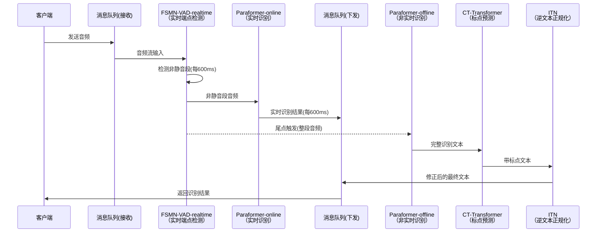

```svg
<svg width="1100" height="820" xmlns="http://www.w3.org/2000/svg">

  <!-- Arrow marker -->
  <defs>
    <marker id="arrow" markerWidth="10" markerHeight="10" refX="8" refY="3" orient="auto">
      <path d="M0,0 L0,6 L9,3 z"/>
    </marker>
  </defs>

  <!-- Online background -->
  <rect x="20" y="20" width="1060" height="360" fill="#eaf3ff" stroke="#bfd7ff"/>
  <text x="40" y="50" font-size="18" font-weight="bold">实时处理（Online）</text>

  <!-- Offline background -->
  <rect x="20" y="400" width="1060" height="380" fill="#ffeaea" stroke="#ffbcbc"/>
  <text x="40" y="430" font-size="18" font-weight="bold">非实时处理（Offline）</text>

  <!-- ===== Online Nodes ===== -->

  <!-- MQ In -->
  <rect x="60" y="120" width="200" height="70" fill="#fff" stroke="#000"/>
  <text x="110" y="145" font-size="14">消息队列</text>
  <text x="80" y="165" font-size="12">(从客户端接收)</text>

  <!-- FSMN-VAD -->
  <rect x="330" y="110" width="230" height="80" fill="#fff" stroke="#000"/>
  <text x="355" y="140" font-size="14">FSMN-VAD-realtime</text>
  <text x="355" y="160" font-size="12">(端点检测实时)</text>

  <!-- Paraformer-online -->
  <rect x="650" y="110" width="230" height="80" fill="#fff" stroke="#000"/>
  <text x="680" y="140" font-size="14">Paraformer-online</text>
  <text x="680" y="160" font-size="12">(语音识别实时)</text>

  <!-- MQ Out -->
  <rect x="900" y="120" width="200" height="70" fill="#fff" stroke="#000"/>
  <text x="950" y="145" font-size="14">消息队列</text>
  <text x="930" y="165" font-size="12">(发送到客户端)</text>

  <!-- Online arrows -->
  <line x1="260" y1="155" x2="330" y2="155" stroke="#000" marker-end="url(#arrow)"/>
  <text x="270" y="140" font-size="12">音频</text>

  <line x1="560" y1="155" x2="650" y2="155" stroke="#000" marker-end="url(#arrow)"/>
  <text x="510" y="140" font-size="12">非静音段 / 600ms</text>

  <line x1="880" y1="155" x2="900" y2="155" stroke="#000" marker-end="url(#arrow)"/>
  <text x="820" y="140" font-size="12">识别文字 / 600ms</text>

  <!-- ===== Offline Nodes ===== -->

  <!-- Paraformer-offline -->
  <rect x="80" y="520" width="230" height="80" fill="#fff" stroke="#000" stroke-dasharray="5,3"/>
  <text x="110" y="545" font-size="14">Paraformer-offline</text>
  <text x="110" y="565" font-size="12">(语音识别非实时)</text>

  <!-- CT-Transformer -->
  <rect x="420" y="520" width="230" height="80" fill="#fff" stroke="#000"/>
  <text x="445" y="550" font-size="14">CT-Transformer</text>
  <text x="445" y="570" font-size="12">(标点预测)</text>

  <!-- ITN -->
  <rect x="760" y="520" width="200" height="80" fill="#fff" stroke="#000"/>
  <text x="800" y="555" font-size="14">ITN（逆文本正规化）</text>

  <!-- Offline arrows -->
  <line x1="310" y1="560" x2="420" y2="560" stroke="#000" marker-end="url(#arrow)"/>
  <line x1="650" y1="560" x2="760" y2="560" stroke="#000" marker-end="url(#arrow)"/>

  <!-- ITN → MQ Out -->
  <line x1="960" y1="560" x2="960" y2="190" stroke="#000" marker-end="url(#arrow)"/>
  <text x="880" y="360" font-size="12">修正后的识别文字</text>

  <!-- VAD triggers -->
  <line x1="445" y1="190" x2="195" y2="520" stroke="#000" stroke-dasharray="5,5" marker-end="url(#arrow)"/>
  <text x="260" y="350" font-size="12">VAD 尾点</text>

  <line x1="445" y1="190" x2="535" y2="520" stroke="#000" stroke-dasharray="5,5" marker-end="url(#arrow)"/>
  <text x="465" y="350" font-size="12">VAD 尾点</text>

</svg>
```